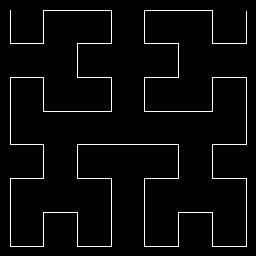

# Fast Hilbert

Fast Hilbert 2D curve computation using an efficient *Lookup Table (LUT)*.

* Convert from discrete 2D space to 1D hilbert space and reverse
* Very fast using an efficient 512 Byte *LUT*
* No additional dependencies except for *rust std lib*.

Benchmarking with [criterion](https://crates.io/crates/criterion) shows that *fast_hilbert* is about **2.5 times faster** compared to the fastest 2D hilbert transformation libs written in rust. Benchmarked on a *Intel i5-6400 CPU @ 2.70 GHz, 4 Cores* with *8 GB RAM*:

| Library          | Time       | Description       |
 ----------------- |-----------:| ----------------- |
| **fast_hilbert** |  **30 ns** | Optimized for fast computation in 2D discrete space using an efficient *LUT*
| [hilbert_2d](https://crates.io/crates/hilbert_2d)      |  75 ns | Also allows other variants such as *Moore* and *LIU* |
| [hilbert_curve](https://crates.io/crates/hilbert_curve)      |   85 ns | Implements algorithm described on [Wikipedia](https://en.wikipedia.org/wiki/Hilbert_curve) |
| [hilbert](https://crates.io/crates/hilbert)      |  798 ns | Allows computation of higher dimensional Hilbert curves |
